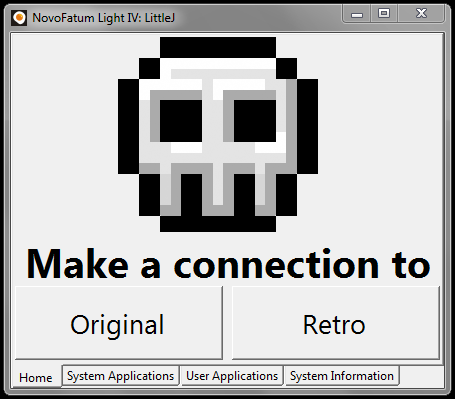

+++
title = "Sobre mi"
description = "📏 + 🔬 + 👨‍💻 + 🚴 + 🐧 + ☁️ = ❤️"
date = "2020-10-09"
aliases = ["sobre-mi"]
author = "José Carlos"
license = "CC BY-NC-ND"
lastmod = "2020-10-09"
image = "history.jpeg"
+++

# Un poco sobre mi

¡Hola, mundo! Bienvenid@ a mi página personal, ya que estás por aquí, permíteme que te cuente **un poco sobre mi**, y **un poco sobre el blog** 😁

## Sobre mi
Me llamo José Carlos, y en el momento que estoy escribiendo esta entrada **tengo 25 años**. Estoy graduado en Matemáticas, y soy un apasionado de la informática general.

Desde que era bastante pequeño **me ha gustado trastear, aprender y romper ordenadores**. Esto hizo que desde **muy temprana edad mostrase interés por la programación**. Tuve mi primer ordenador con apenas 6 años 👶, y con apenas **9 años la programación👨‍💻 me empezó a despertar curiosidad**. Junto a un amigo del colegio empezamos a **crear páginas webs estáticas** gracias a servicios como [Palimpalem](https://www.palimpalem.com/). Cuando las páginas estáticas se me empezaron a quedar cortas, empecé a trastear con PHP y comencé a **añadir un poco de interactividad a mis antiguas páginas estáticas** gracias a servicios como [MiArroba](https://miarroba.com/), que eran gratuitos y antes no me podía permitir 😭.

Más adelante, empecé a explorar otro mundo bastante completo como es el de las CMS, **mis primeros pasos fueron con [Joomla!](https://www.joomla.org/)**, y me ayudó para a crear una página, aún se puede encontrar en web.archive.org una copia de lo que fue **mi primera web con Joomla! y se puede visitar [aquí](https://web.archive.org/web/20090922235954/http://www.serieh.com/)**

A la par de estas aventuras, comenzó **unas de mis experiencias más fructiferas en el mundo de internet** gracias a Kekomundo, **un foro donde se desarrollaban servidores para copias de juegos online**. En este mundo me di a conocer con varios proyectos, que muchos nostálgicos conocerán, y me hizo estar relacionado muchos años con Habbo Hotel.

De esta relación con Habbo Hotel, **se desató mi pasión por la seguridad informática y por las matemáticas**, y creo que fue el momento donde realmente **me di cuenta que tenía que aprender más matemáticas para complementar mi formación** que había desarrollado años atrás gracias a la curiosiad. En esta época **encontré una serie de exploits** dentro del cliente de Habbo Hotel **que permitían hacer un Man-in-the-middle**, debido a los **problemas que existían en la implementación del cliente**, en **la librería Diffie-Hellman** y más adelante usando tećnicas de **detección de patrones buscando en la memoria RAM.**

Después de unos años muy divertidos y fructíferos, **abandoné por completo este mundo para dedicarme plenamente al desarrollo de software libre, mis estudios y mi trabajo.**

Cuando estaba en tercero de carrera, empecé a trabajar como desarrollador de software, donde también realizaba, operaciones y tareas de monitorización. Fueron 3 años muy fructifero, y más allá de que fuera mi primera experiencia profesional, me sirvió para **aprender muchísimo del mundo Linux** y me ayudó para **desarrollar mi creatividad**.

A día, de hoy estoy empezando una nueva aventura laboral, y estoy trabajando en un proyecto de software libre que se llama [Tungsteno](https://github.com/tungstenoapp/Tungsteno), que trata de crear una alternativa libre para el Wolfram Mathematica. 😁