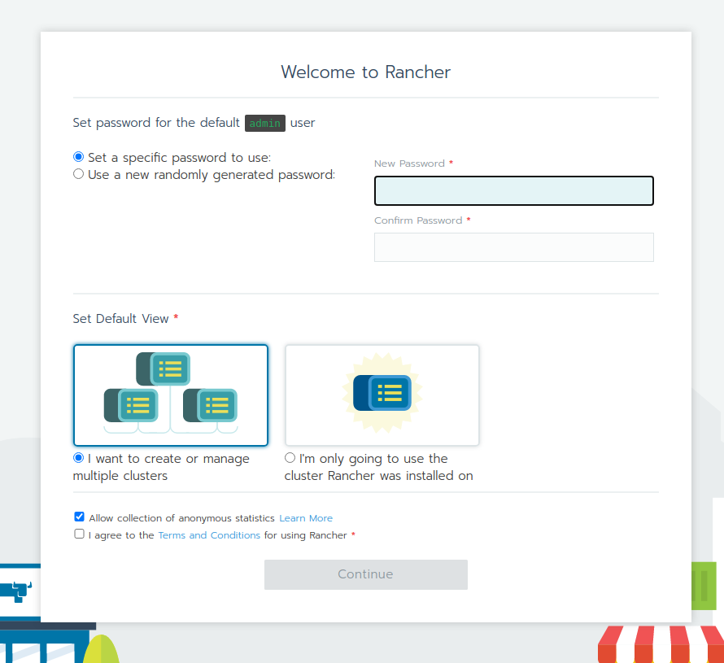
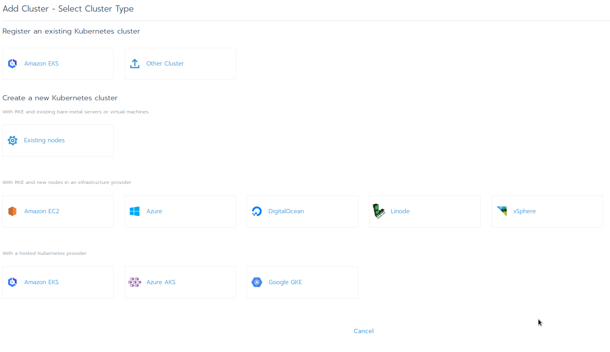
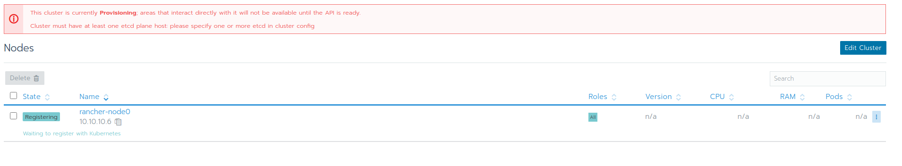
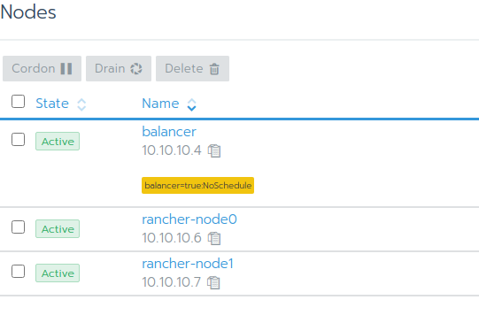
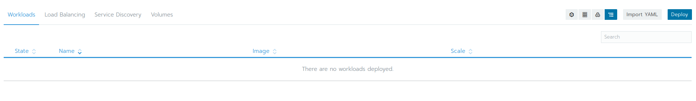
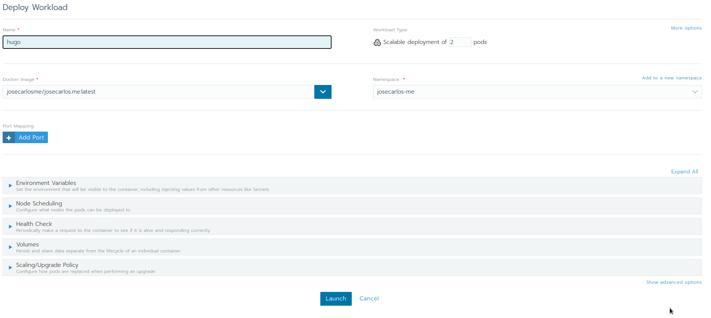
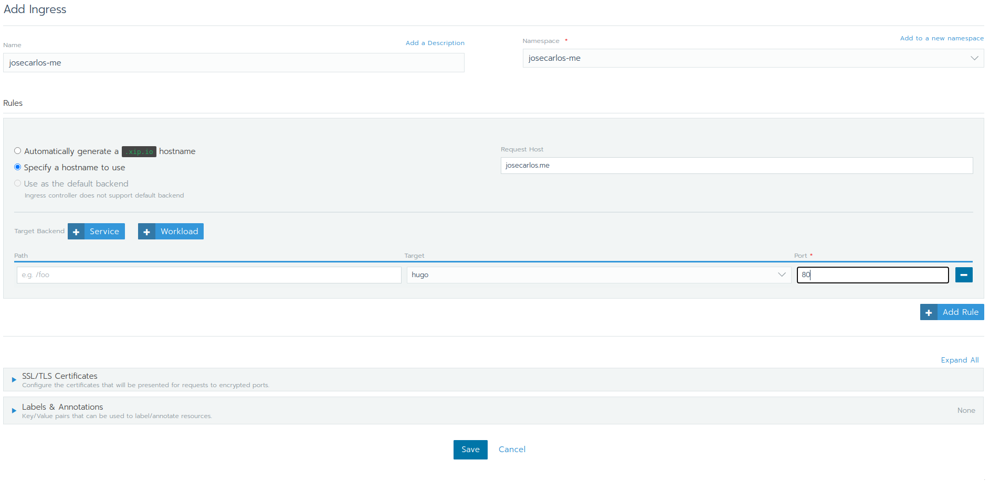

+++
author = "José Carlos García"
date = 2021-02-26T10:00:50Z
description = ""
draft = false
image = "cover.jpeg"
slug = "mi-nueva-infraestructura"
title = "Mi nueva infraestructura. Proxmox + Private Network + Terraform + VPN + Kubernetes (Rancher)"
categories = ["ops"]
tags = ["ops", "proxmox", "kubernetes", "private-network", "wireguard"]

+++

Hasta el momento, tenía contratado 4 VPS con una capacidad bastante limitada dónde he desplegado mis dos principales proyectos personales, tungsteno.app y josecarlos.me.
En estos servidores virtuales tenía desplegado un clúster de Kubernetes con un total de 4vCPU y 8GB de RAM.

En las últimas semanas, he estado atento a las ofertas de servidores dedicados de [Kimsufi](https://www.kimsufi.com/es/), una empresa que alquila servidores dedicados antiguos a un precio reducido, y he conseguido contratar el servidor KS-11, por tanto, ahora tengo una CPU de 8 hilos y 16 GB de RAM, y aunque es lento, también dispongo de 2TB de disco HDD. Estas condiciones me ayudaron a decidirme a montar un Proxmox, con distintas máquinas virtuales montadas con Terraform, una red privada, un entorno propio de laboratorio y muchas otras opciones para probar.



## Proxmox
Proxmox Virtual Environment, o Proxmox VE, entorno de virtualización de servidores de código abierto. Está en distribuciones GNU/Linux basadas en Debian con una versión modificada del Kernel RHEL y permite el despliegue y la gestión de máquinas virtuales y contenedores. Proxmox VE incluye una consola Web y herramientas de línea de comandos, y proporciona una API REST para herramientas de terceros. Dos tipos de virtualización son compatibles: los contenedores basados con LXC (a partir de la versión 4.0 reemplaza OpenVZ, utilizado en la versión 3.4, incluido3​), y la virtualización con KVM. Viene con un instalador e incluye un sitio Web basado en la interfaz de administración.

### Instalación
Desde Kimsufi, o OVH tienes la posibilidad de instalar directamente un dedicado con la imagen de Proxmox. Si tienes otro proveedor, que no ofrece la opción de instalarlo desde las opciones de "despliegue", siempre puedes ver las [guías de instalación en la Wiki de Proxmox](https://pve.proxmox.com/wiki/Category:Installation).

### Configurando una red privada para todas las máquinas virtuales
En mi proveedor del dedicado, sólo ofrecen la posibilidad de tener una IP pública por dedicado, así que he tenido que configurar una red privada, y con configuraciones de port forwarding para redirigir desde la IP pública, a las distintas máquinas virtuales según el puerto.

Por defecto, mi servidor dedicado venía con estas interfaces de red:

    root@xxxx:~# ip a
    1: lo: <LOOPBACK,UP,LOWER_UP> mtu 65536 qdisc noqueue state UNKNOWN group default qlen 1000
        link/loopback 00:00:00:00:00:00 brd 00:00:00:00:00:00
        inet 127.0.0.1/8 scope host lo
        valid_lft forever preferred_lft forever
        inet6 ::1/128 scope host
        valid_lft forever preferred_lft forever
    2: enp1s0: <BROADCAST,MULTICAST,UP,LOWER_UP> mtu 1500 qdisc pfifo_fast master vmbr0 state UP group default qlen 1000
        link/ether 00:25:90:76:dd:00 brd ff:ff:ff:ff:ff:ff
    3: enp2s0: <BROADCAST,MULTICAST> mtu 1500 qdisc noop state DOWN group default qlen 1000
        link/ether 00:25:90:76:dd:01 brd ff:ff:ff:ff:ff:ff
    4: vmbr0: <BROADCAST,MULTICAST,UP,LOWER_UP> mtu 1500 qdisc noqueue state UP group default qlen 1000
        link/ether 00:25:90:76:dd:00 brd ff:ff:ff:ff:ff:ff
        inet <ip publica>/24 brd <gateway>.255 scope global dynamic vmbr0
        valid_lft 81716sec preferred_lft 81716sec
        inet6 <ip publica>/64 scope link
        valid_lft forever preferred_lft forever

Con la siguiente configuración:

    auto lo
    iface lo inet loopback

    iface enp1s0 inet manual

    iface enp2s0 inet manual

    auto vmbr0
    iface vmbr0 inet dhcp
        bridge-ports enp1s0
        bridge-stp off
        bridge-fd 0

    auto vmbr1

Nuestro objetivo es crear un puente virtual en nuestro dedicado, dónde desplegaremos las IPs de nuestras máquinas virtuales. Para ello, editamos el fichero `/etc/network/interfaces`, y añadimos al final:

    auto vmbr1 # Nombre de la interfaz
    iface vmbr1 inet static
        address 10.10.10.1/24 # IP dentro de esta interfaz.
        bridge-ports none
        bridge-stp off
        bridge-fd 0

        post-up   echo 1 > /proc/sys/net/ipv4/ip_forward # Permite hacer port-forwarding para mandar puertos a VM.
        post-up iptables -t nat -A PREROUTING -i vmbr0 -p udp --dport 51820 -j DNAT --to 10.10.10.3:51820 # Ejemplo de mandar puerto 51820 UDP a VM.
        post-down iptables -t nat -D PREROUTING -i vmbr0 -p udp --dport 51820 -j DNAT --to 10.10.10.3:51820
        post-up   iptables -t nat -A POSTROUTING -s '10.10.10.0/24' -o vmbr0 -j MASQUERADE # Permite acceder a la red accediendo desde vmbr0
        post-down iptables -t nat -D POSTROUTING -s '10.10.10.0/24' -o vmbr0 -j MASQUERADE
        post-up   iptables -t nat -A POSTROUTING -s '10.10.11.0/24' -o vmbr0 -j MASQUERADE # Para la VPN
        post-down iptables -t nat -D POSTROUTING -s '10.10.11.0/24' -o vmbr0 -j MASQUERADE
        post-up iptables -t nat -A PREROUTING -i vmbr0 -p tcp -m tcp --dport 80 -j DNAT --to-destination 10.10.10.4:80 # Manda el tráfico del 80 al balanceador de carga
        post-up iptables -t nat -A PREROUTING -i vmbr0 -p tcp -m tcp --dport 443 -j DNAT --to-destination 10.10.10.4:443 # Manda el tráfico del 443 al balanceador de carga.

Finalmente, ejecutamos `service networking restart` y tendremos una red virtual privada creada para nuestras máquinas virtuales.

### Creando template con Debian 10 Proxmox.
Ejecutamos el siguiente script para crear un template con Debian 10 con soporte para Cloud Init:

    wget https://cdimage.debian.org/cdimage/openstack/current/debian-10-openstack-amd64.qcow2

    # Create a VM
    qm create 9110 --name debian10-cloud --memory 2048 --net0 virtio,bridge=vmbr1

    # Import the disk in qcow2 format (as unused disk)
    qm importdisk 9110 debian-10-openstack-amd64.qcow2 local -format qcow2

    # Attach the disk to the vm using VirtIO SCSI
    qm set 9110 --scsihw virtio-scsi-pci --scsi0 /var/lib/vz/images/9110/vm-9110-disk-0.qcow2

    # Important settings
    qm set 9110 --ide2 local:cloudinit --boot c --bootdisk scsi0 --serial0 socket --vga serial0

    # The initial disk is only 2GB, thus we make it larger
    qm resize 9110 scsi0 +30G

    # Using a  dhcp server on vmbr1 or use static IP
    qm set 9110 --ipconfig0 ip=10.10.10.2/24,gw=10.10.10.1

    # user authentication for 'debian' user (optional password)
    qm set 9110 --sshkey ~/.ssh/id_rsa.pub

    # check the cloud-init config
    qm cloudinit dump 9110 user

    # create tempalte and a linked clone
    qm template 9110

En este punto, tendremos un template con Debian 10, listo para ser clonado en nuestras nuevas máquinas virtuales.

### Creando máquinas con Terraform.
En la carpeta donde vayamos a escribir los ficheros de Terraform, creamos un fichero `versions.tf` con el siguiente contenido:

    terraform {
        required_providers {
            proxmox = {
            source  = "Telmate/Proxmox"
            version = ">=1.0.0"
            }
        }
    required_version = ">= 0.13"
    }

Este fichero, le dirá a Terraform que plugins usar, a continuación creamos el fichero `main.tf`:

    provider "proxmox" {
        pm_api_url      = "https://<ip publica>:8006/api2/json"
        pm_user         = "root@pam"
        pm_tls_insecure = true
    }

Este bloque, te permitirá conectarte a tu Proxmox, para generar máquinas fácilmente. Ejecutamos `terraform init` y ya podremos empezar a trabajar.

### VPN (Wireguard): Acceder desde fuera a la red virtual.
Configuración Terraform:
    resource "proxmox_vm_qemu" "vpn" {
        name = "vpn"

        target_node = "xxxx"
        os_type     = "cloud-init"

        clone = "debian10-cloud"

        memory = 512
        cores  = "1"

        sshkeys = "<tu clave SSH>"

        ipconfig0 = "ip=10.10.10.3/32,gw=10.10.10.1" # Aquí configuramos la IP privada de nuestra VM

        bootdisk = "scsi0"

        disk {
            type    = "scsi"
            storage = "local"
            size    = "35G"
        }

        lifecycle {
            ignore_changes = [
            network,
            ]
        }
    }

Ejecutamos `terraform apply` para que cree la máquina, y una vez que se haya creado la máquina, entraremos para instalar y configurar wireguard:

1. Ejecutamos `sudo apt update`
2. Ejecutamos `sudo apt upgrade`
3. Activamos el repositorio de backports, que es donde se aloja wireguard: `sudo sh -c "echo 'deb http://deb.debian.org/debian buster-backports main contrib non-free' > /etc/apt/sources.list.d/buster-backports.list"`
4. Volvemos a actualizar nuestros repositorios: `sudo apt update`
5. Instalamos wireguard: `sudo apt install wireguard`
6. Entramos en `/etc/wireguard/`; `cd /etc/wireguard/`
7. Generamos las claves privadas y públicas del servidor: `umask 077; wg genkey | tee privatekey | wg pubkey > publickey`
8. Creamos el fichero wg0.conf:

        [Interface]
        Address = 10.10.11.1/24 # IP de los clientes y servidor de la VPN
        ListenPort = 51820
        PrivateKey = <contenido fichero /etc/wireguard/privatekey>
        PostUp = iptables -t nat -A POSTROUTING -o eth0 -j MASQUERADE;  iptables -A FORWARD -i %i -j ACCEPT; iptables -A FORWARD -o %i -j ACCEPT # Permitimos a los clientes acceder a la red privada.

9. En nuestro ordenador local instalamos wireguard, y accedemos a `/etc/wireguard/` y seguidamente, ejecutamos `umask 077; wg genkey | tee privatekey | wg pubkey > publickey`
10. Volvemos, al servidor y copiamos la clave pública del cliente, y creamos un peer de wireguard:

        [Peer]
        PublicKey = <Clave pública del cliente>
        AllowedIPs = 10.10.11.2/24  # IP del cliente

11. Iniciamos wireguard en la máquina virtual: `systemctl enable wg-quick@wg0 --now`
12. En nuestro ordenador local, terminamos de configurar wireguard, creamos el fichero `/etc/wireguard/wg0.conf`

        [Interface]
        Address = 10.10.11.2/24 # IP del cliente
        DNS = 8.8.8.8
        PrivateKey = <Private key de nuestra máquina>

        [Peer]
        PublicKey = <Public key del servidor>
        AllowedIPs = 10.10.10.0/24 # IPs que van a pasar por la VPN, en nuestro caso 10.10.10.0/24 porque son las de vmbr1
        Endpoint = <ip publica servidor>:51820
        PersistentKeepalive = 25
13. Iniciamos en local la VPN: `systemctl enable wg-quick@wg0 --now`

### Otras máquinas necesarias
Se crearán 4 máquinas virtuales más:
1. Balancer, una máquina con debian 10 con la IP 10.10.10.4, que será un worker de de Kubernetes donde ejecutaremos simplemente el NGINX Ingress (1GB de RAM | 1 CPU)
2. 2 rancher-nodes, donde desplegaremos etcd, controlplane y los pods del clúster. (2GB de RAM | 2 CPU)
3. Rancher, panel de administración de K8s. (2GB de RAM | 1 CPU)

## Kubernetes fácilmente: Rancher

### Instalando Rancher
Rancher puede instalarse directamente en un clúster existente de Kubernetes, podemos desplegarlo dentro de K3s, o simplemente ejecutarlo desde docker. En un entorno de producción **no es recomendable** instalar rancher directamente desde docker, aún así, para mi caso, que no es un entorno crítico, lo instalaré directamente en docker para ahorrarme recursos:
1. Creamos la máquina para rancher, que tendrá la IP 10.10.10.5
2. Instalamos docker, `sudo apt update; sudo apt install docker.io`
3. Ejecutamos e instalamos rancher: `docker run -d --restart=unless-stopped   -p 80:80 -p 443:443   --privileged   rancher/rancher:latest`

Esperamos, un tiempo y podremos acceder al panel de rancher por primera vez:

Una vez terminada la configuración inicial, veremos el listado de todos los clústers de K8s administrados desde rancher, en este momento, sólo veremos uno *local*, que es el propio clúster de Rancher. Nuestra siguiente tarea será crear un clúster de Kubernetes para las dos máquinas nuevas que hemos creado:

### Creando un nuevo clúster de Kubernetes.
Desde la interfaz de rancher, hacemos click sobre **Add cluster**, y veremos la siguiente interfaz:

En mi caso, voy a lanzar un nuevo clúster en *Existing nodes*, pero si nuestra infraestructura está desplegada en otro proveedor, podemos también desplegarla fácilmente desde rancher. En mi clúster, he añadido la siguiente configuración:
- **Nombre: ** my-kube
- **Network provider: **: calico

Una vez rellenada esta configuración, nos mostrará una pantalla con un comando que debemos ejecutar en las máquinas que queremos que formen parte del clúster. En un entorno de producción es recomendable instalar etcd, controlplane y worker por separado. Para mi caso particular, que es un entorno "para mi", voy a instalar etcd, controlplane y worker en la misma máquina:

    sudo apt update
    sudo apt install docker.io
    sudo docker run -d --privileged --restart=unless-stopped --net=host -v /etc/kubernetes:/etc/kubernetes -v /var/run:/var/run rancher/rancher-agent:v2.5.5 --server https://10.10.10.5 --token xxxxx --ca-checksum xxxxx --etcd --controlplane --worker

A medida que ejecutamos este comando en todas las máquinas, veremos como nuestros nodos pasarán a formar parte del nuevo clúster de Kubernetes que hemos creado:

En este punto, nos toca tener paciencia y esperar a que los nodos terminen de desplegarse... Cuando terminen de desplegarse, veremos lo siguiente:

### Primeras configuraciones
1. Creamos un nuevo proyecto dónde desplegaremos las aplicaciones de josecarlos.me, tungsteno.app y demo.tungsteno.app
   1. Buscamos en el menú `Project/Namespaces`
   2. Le damos a `Add project`
   3. Creamos un nuevo proyecto, y accedemos al administrador del proyecto.

### Desplegando mis aplicaciones
En primer lugar, vamos a desplegar josecarlos.me. Accedemos a *workloads*, veremos la siguiente interfaz:

Hacemos click sobre **Deploy**, y desplegamos el pod con la imagen Docker de nuestra aplicación:
.

Configuramos un balanceador de carga para mandar josecarlos.me hacia el pod creado anteriormente. Entramos en primer lugar sobre *load balancing*, seguidamente hacemos click sobre **Add ingress**:

.

Repitiendo el proceso para tungsteno.app, habremos terminado.

## Conclusiones