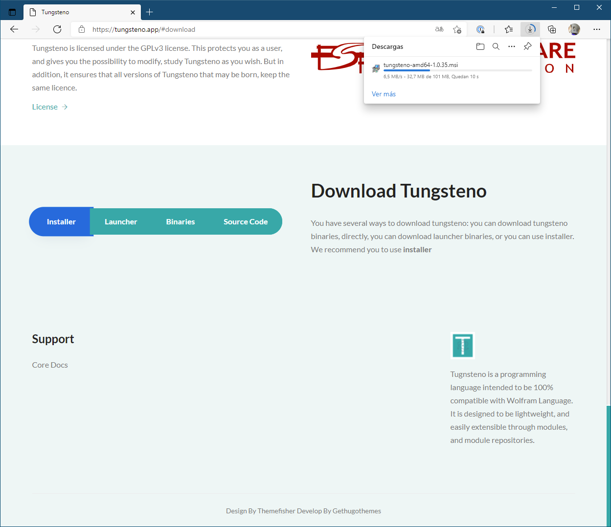
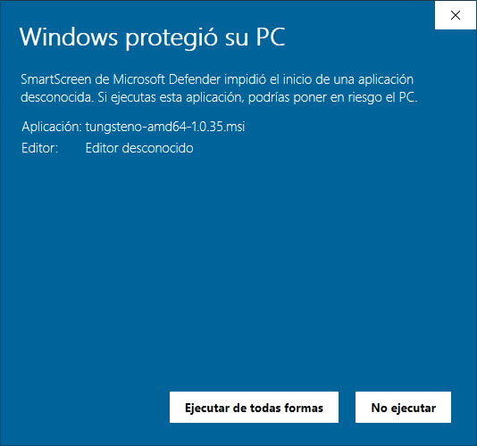
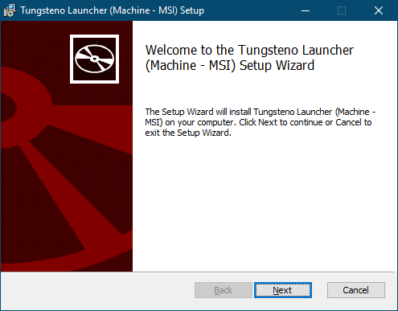
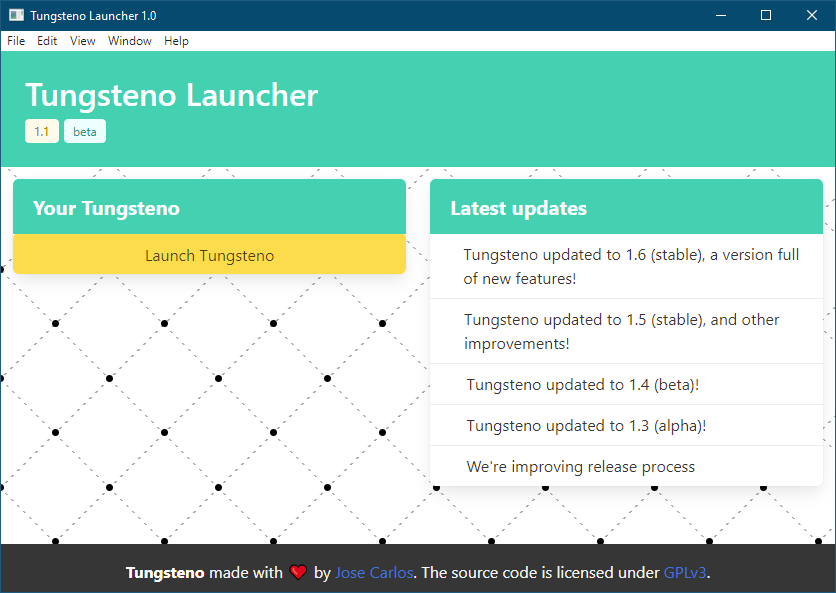
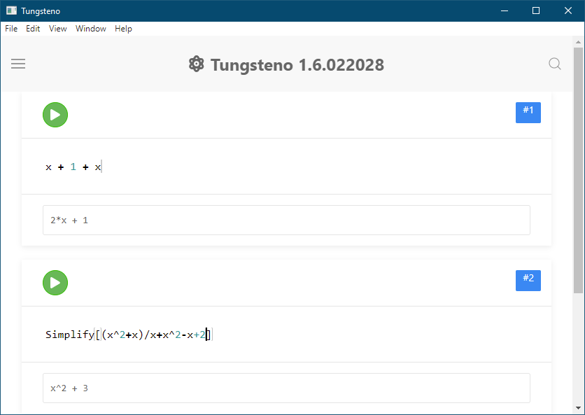
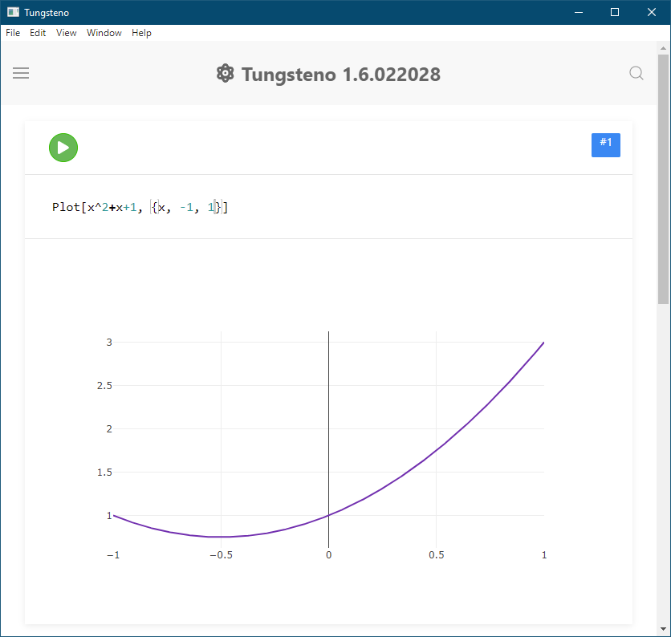

+++
author = "José Carlos García"
date = 2021-07-10T10:00:50Z
description = ""
draft = false
image = "science.jpg"
slug = "aprendiendo-matematicas-tungsteno-1"
title = "Aprendiendo matemáticas y programación con Tungsteno #1"
categories = ["tungsteno"]
tags = ["tungsteno", "personal"]

+++

Tungsteno es un software open-source gratuito desarrollado como alternative al Wolfram Mathematica. Muchas de las funciones del core del Wolfram Mathematica ya están disponibles en el catálogo de funciones de Tungsteno, otras sin embargo, aún no están implementadas, pero eres libre de pedir esas funciones, o implementarlas tu mismo.

Tungsteno es una herramienta genial para aprender matemáticas y programación de una forma amigable y sencilla, al alcance de todo el mundo. A continuación, se hará una introducción de como descargar Tungsteno y como puede ayudarte a enseñar.



# Primeros pasos

## Descargando Tungsteno

1. Abrimos la página oficinal de Tungsteno (https://tungsteno.app)
2. Hacemos click en el menú sobre "Download".
3. Hacemos click en "Installer", y automáticamente te descagará la última versión compatible con tu sistema operativo.
4. Cuando termine de descargar haz click sobre ejecutar de todas formas.
5. Continua los pasos del instalador
6. Abre Tungsteno una vez que termine la instalación.
7. Descarga la última compilación disponible (Haciendo click sobre Download)
8. Lanza Tungsteno
     

# Trabajando con expresiones algebráicas
Tungsteno permite trabajar con expresiones algebráicas tal y como las escribiría a mano. Es capaz de sumar monomios, polinómios, funciones... .

## Operando expresiones algebráicas

Si escribimos:

    x + 1 + x

Tungsteno nos devolverá:

    2*x+1

También podemos sumar y restar expresiones algebráicas:

    x + 1 + x^(2) + x + x^(2)

Nos devolverá:

    2*x^2 + 2*x + 1

## Simplificar expresiones algebráicas

Para simplificar expresiones algebraicas, simplemente tenemos que hacer Simplify[expression]:

Si escribimos:

    Simplify[(x^2+x)/x + x^2-x+2]

Nos devolverá:

    x^2+3

## Expandir expresiones algebraicas

Para expandir expresiones algebraicas, por ejemplo, convertir (x+1)*(x-1) en x^2-1 tenemos la función Expand[expression]

Si escribimos:

    Expand[(x+1)*(x-1)]

Nos devolverá:

    x^2-1

## Resolviendo ecuaciones (e inecuaciones) de cualquier grado
Si queremos resolver una ecuación de cualquier tipo, tenemos la función Solve, que se llamaría: Solve[expression, variable]

Por ejemplo, si queremos resolver x^2-1 = 0 escribiriamos:

    Solve[x^2-1==0, x]

Y nos devolverá:

    {{x-> 1}, {x -> -1}}

Por ejemplo, si queremos resolver 2^x = 8 escribiriamos:

    Solve[2^x==8, x]

Y nos devolverá:

    {x -> 3}

## Pintando funciones

Si queremos pintar la función x^2+x+1 en el intervalo [-1, 1] debemos llamar Plot[x^2+x+1, {x, -1, 1}]

## Derivando funciones
Si queremos derivar una funcion de cualquier tipo, tenemos la función D, que se llamaría: D[expression, variable]

Por ejemplo, si queremos derivar x^2-1 escribiriamos:

    D[x^2-1, x]

Y nos devolverá:

   2*x

## Resolviendo integrales
Si queremos resolver una integral de cualquier tipo, tenemos la función Integrate, que se llamaría: Integrate[expression, variable]

Por ejemplo, si queremos integrar x^2-1 escribiriamos:

    Integrate[x^2-1, x]

Y nos devolverá:

   (1/3)*x^3 - x

# Conclusiones

Tungsteno ofrece una experiencia bastante completa para los alumnos de cualquier enseñanza. El entorno de trabajo de Tungsteno ofrece a los alumnos un entorno cómodo, familiar y sencillo.